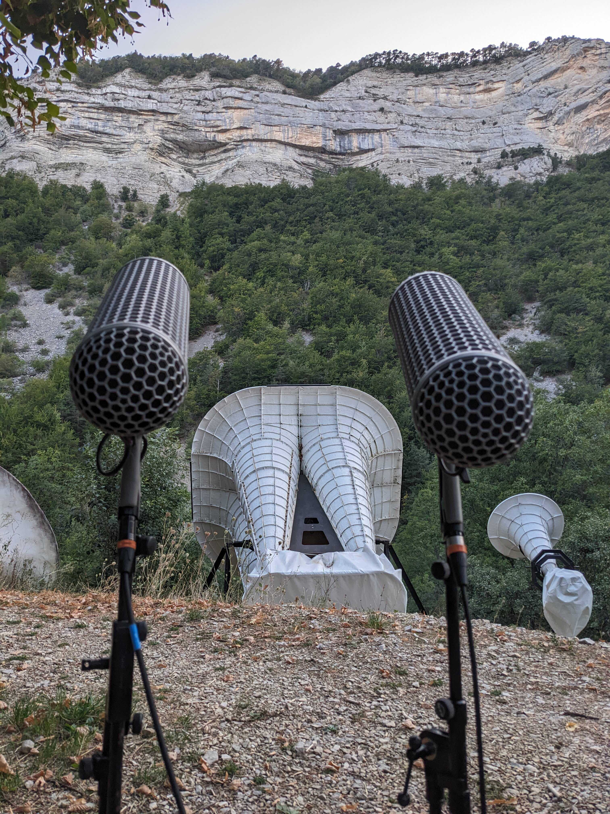

# Présentation du lieu
Depuis 2021 [**Le Vidéobus**](https://www.levideobus.fr/) (association d'éducation à l'image) intervient chaque été au sein de [**La ferme du Faï**](http://www.villagesdesjeunes.org/noslieuxdaccueil/lefai/) pour accompagner des jeunes à réaliser leurs court-métrages.

Cette ferme, situé au cœur d’un cirque de moyenne montagne dans les Alpes, présente des particularités acoustiques exceptionnelles:

> *En 1991, Jacques Chataignier, remarquant la résonance particulière du lieu, décide de créer un système acoustique lui étant dédié. Après trois années de recherches permettant de révéler que la puissance, mais aussi la directivité du son revêtent une importance capitale dans la qualité finale d'écoute, la construction des trompes débute en 1994. Elle est permise par la présence continue de chantiers de volontariat menés par l'association Villages des Jeunes et de Michel Stievenart, ingénieur du son, qui dessine les plans et permet la mise en marche des trompes médium et aiguë.*

[*Affiche d'information dans la régie son de la Ferme du Fai*]

# Notre démarche
Nous accompagnons en l'espace d'une semaine les jeunes à réaliser leur film en équipe, de l'écriture du scénario à la projection finale. Durant tout le processus de réalisation, les apprentis cinéastes doivent garder en tête qu'une partie du son de leur film sera diffusé par les trompes, et l'autres en facade (au niveau de l'écran). Cela revêt aussi bien un défi artistique: *s'imaginer comment la montagne va déformer leur son et comment l'integrer à leur court-métrage,* qu'un défi technique: *comment synchroniser le son des trompes avec celui de la facades (délai)? Comment procurer aux spectateurs qui n'ont pas eut la chance d'assister à la projection des perceptions proches de celles ressentis sur place.*

## Résidence sonore
Dans le but de répondre à ces questions et d'accompagner au mieux les futurs publics de nos atteliers, nous sommes retournés du 5 au 8 septembre 2023 à la ferme du Fai, cette fois sans jeunes, pour expérimenter dans tous les sens avec ce lieu singulier.

Afin de pouvoir simuler le son du lieu à posteriori sur ordinateur, l'un de nos objectifs était d'enregistrer les empreintes sonores de sa réverberation.
Cela va permettre aussi bien de pouvoir préecouter et s'imaginer ce qu'un son va rendre en diffusion réelle dans les trompes, mais aussi post-processer les film pour pouvoir les diffuser n'importe où.

Ces empreintes sont appelées [**réponses impulsionnelles**](https://fr.wikipedia.org/wiki/R%C3%A9ponse_impulsionnelle), elle représente la réponse du lieu ou d'un effet audio à une très courte impulsion audio.

## Détails du protocole

La méthode que nous avons sélectionné afin d'obtenir les réponses impulsionnelles est la suivante: diffuser un balayage en fréquence d'une minute dans les trompes (du grave aux aigus) et enregistrer le son produit avec un couple de micro en stéréo.
Ensuite le plugin ***IR Measurement tools*** d'Ableton Live se charge de convertir cet enregistrement en réponse impulsionnelle.

[Télécharger le sweep](sweep/Sweep-48000-24-M-60,0s.wav)

Ces réponses impulsionnelles (**IR** ou **Impulse Response** en anglais) peuvent par la suite être utilisées dans n'importe quelle reverb à convolution.

### Matériel utilisé
- prise de son:
	- Sennheiser ...
	- rycote ...
- carte son Focusrite 2i4 (24b-48kHz)
- Ableton Live 11
	- plugin IR Measurement tools ([HissTools](https://research.hud.ac.uk/institutes-centres/cerenem/projects/thehisstools/))

### Format
Les IR sont enregistrées au format **AIFF** à la fréquence d'échantillonnage **48 kHz** et à l'échelle de quantification **24 bits**.
***

### Description des IR

#### IR_CAMPING_HAUT

**GPS**: 44.45944068,5.83144419

[**Télécharger l'Impulse Response**](impulse_response/IR_Camping_haut.aif)

#### IR_CHEMIN_HAUT

**GPS**: 44.45931267,5.83173791

[**Télécharger l'Impulse Response**](impulse_response/IR_Chemin_haut.aif)

#### IR_CHEMIN_HAUT_2

**GPS**: 44.45854958,5.83180006

[**Télécharger l'Impulse Response**](impulse_response/IR_Chemin_haut2.aif)

#### IR_ECOMUSÉE_HAUT
**GPS**: 44.45970719,5.83128755

[**Télécharger l'Impulse Response**](impulse_response/IR_Ecomusee_haut.aif)

#### IR_FERME_TABLE_PICNIC

**GPS**: 44.45915457,5.8307081

[**Télécharger l'Impulse Response**](impulse_response/IR_Ferme_Table-pique-nique.aif)

#### IR_A_COTE_TROMPE
**GPS**: 44.45874825,5.83116762

[**Télécharger l'Impulse Response**](impulse_response/IR_A_Cote_trompe.aif)

# Contribution
N'hésitez pas à contribuer à cette banque d'IR en proposant une pull request avec la ou les IR que vous avez enregistré.
